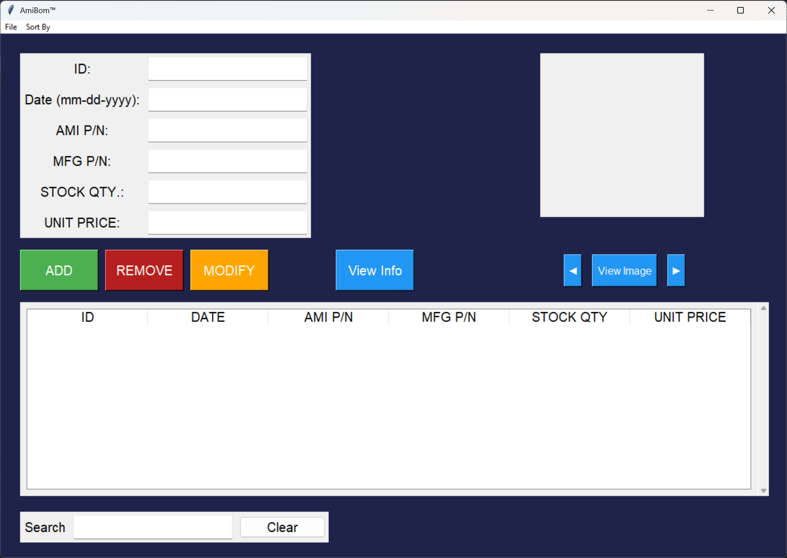
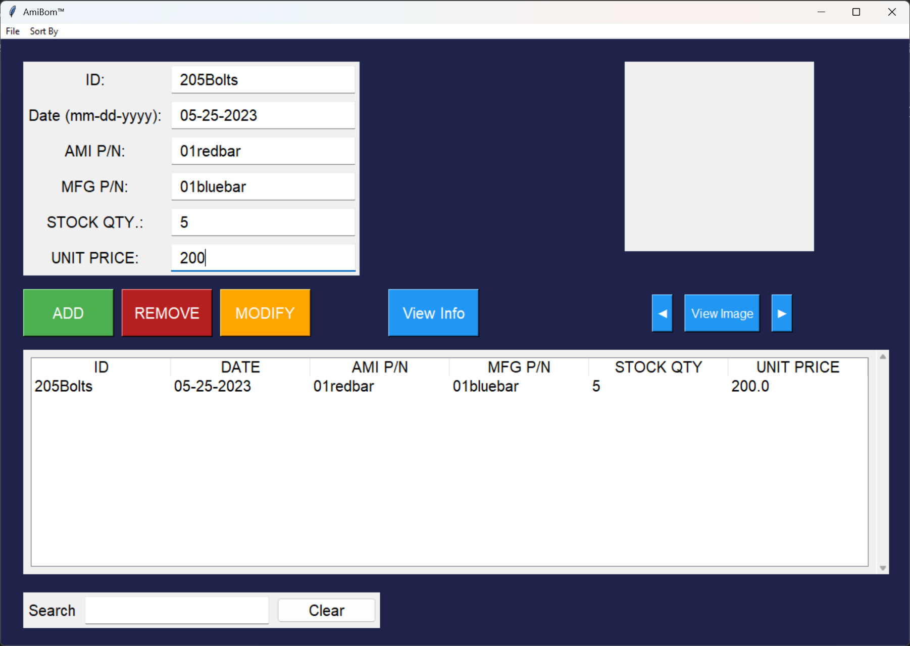
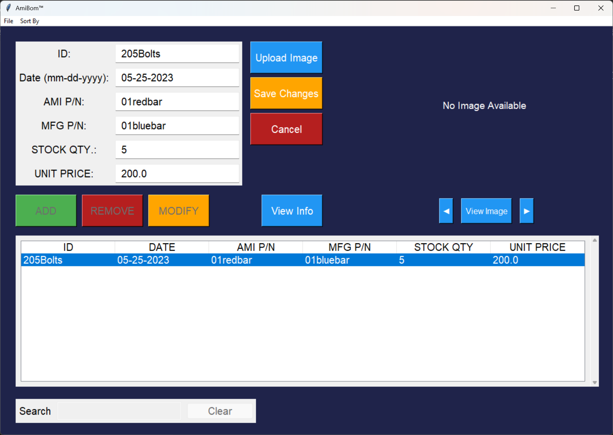
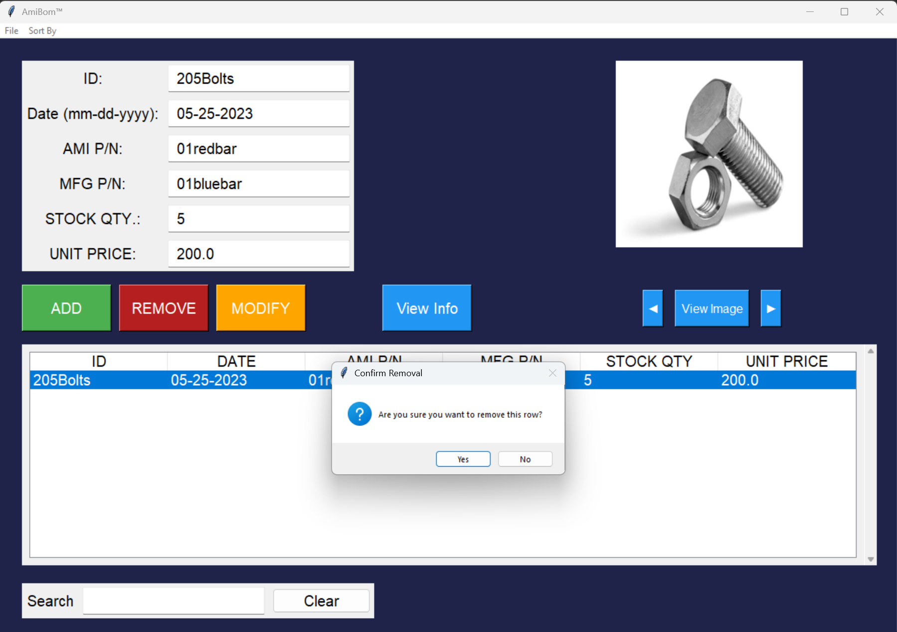
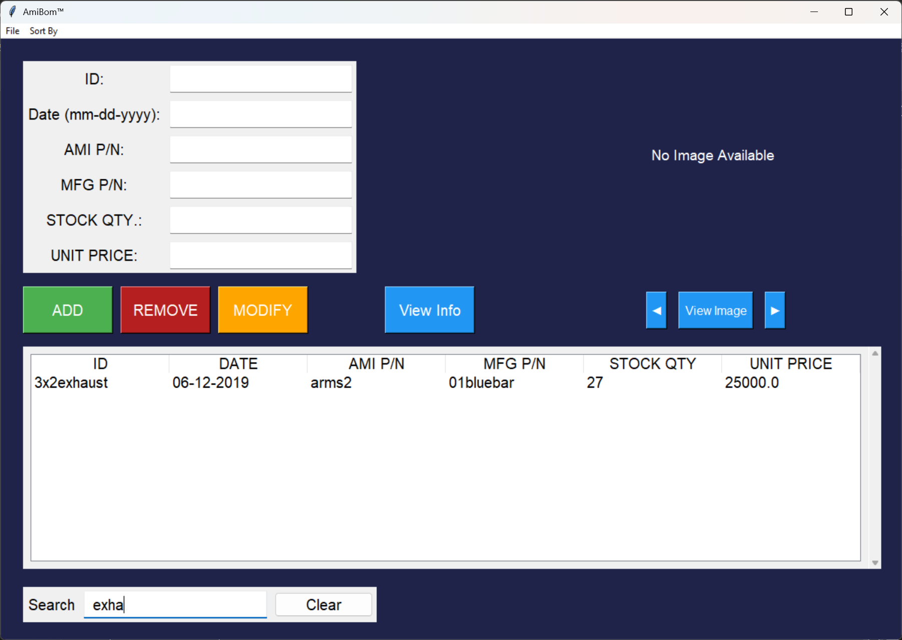
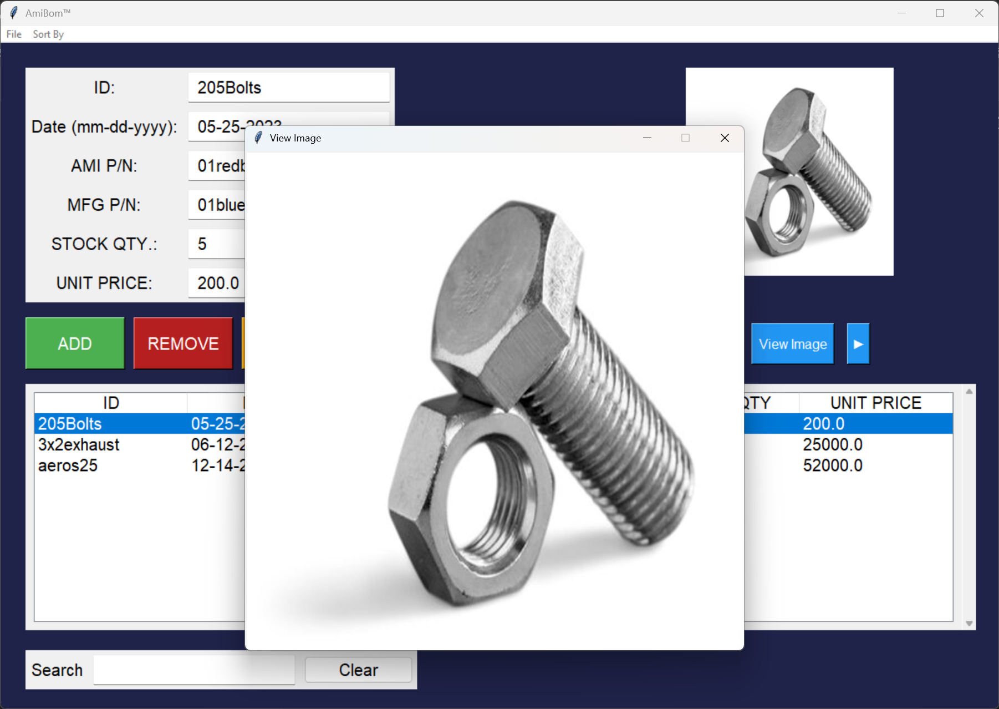

# Inventory Management System (AmiBom™)

A **desktop inventory management system** built in **Python** using **Tkinter** and **SQLite**.  
This system allows users to **add, modify, remove, search, sort, and view inventory items**, including product images.  
The database is **automatically created** if none exists, making the system portable across computers.

---

## Features

### Add Row
- Insert a new inventory item with **ID, Date, AMI P/N, MFG P/N, Stock Quantity, Unit Price**, and optional image.  
- Input validation prevents empty fields or invalid entries.

### Modify Row
- Edit all fields of an existing inventory item.  
- Temporary image upload supported.  
- Buttons and table are disabled during modification to prevent conflicts.

### Remove Row
- Delete a selected inventory item.  
- Confirmation prompt prevents accidental deletion.

### Search & Sort
- Search by any keyword (**case-insensitive**).  
- Sort columns ascending/descending: **ID, Date, Stock Qty., Unit Price**.

### View Image
- View uploaded product images in a modal window.  
- Images are automatically resized to fit display area.

### Auto-Database Creation
- If no database exists, a new SQLite database is created automatically in the project folder.  
- One-time popup notifies the user of database creation.

### Export to Excel
- Export all inventory items to an **Excel file** using **pandas**.

---

## Screenshots

| Screenshot | Description |
|------------|-------------|
|  | Full main GUI window with table and form fields |
|  | Adding a new inventory item (fields filled + item in table) |
|  | Modifying an existing row (show temporary upload image button) |
|  | Confirmation dialog for deleting a row |
|  | Search and sort functionality |
|  | Modal popup showing product image |

> Tip: Use **clear, readable images**. Highlight buttons or fields if possible.

---

## Installation

1. Clone the repository:

```bash
git clone https://github.com/SE-Looweh05/Inventory-Management-System.git
